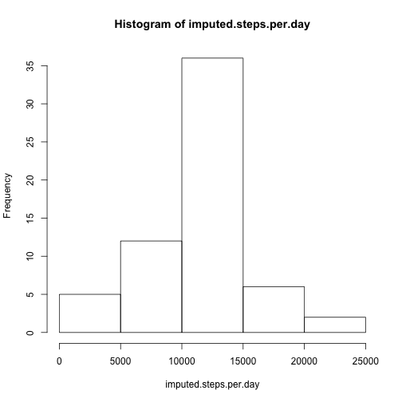
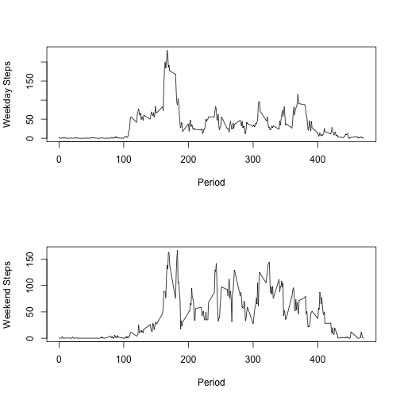

## Loading and preprocessing the data
The following code ingests the steps data from the repository

```r
activity <- read.csv('activity.csv')
```

## What is mean total number of steps taken per day?
To obtain the total number of steps per day, aggregate the steps column of by date value and apply the sum function: 


```r
steps.per.day <- aggregate(activity$steps, by=list(activity$date), FUN=sum,simplify=TRUE,na.rm=TRUE)[,2]
hist(steps.per.day)
```

 

The mean and median steps per day are computed as follows:

```r
mnm <- data.frame(rbind(Mean=mean(steps.per.day), Median=median(steps.per.day)))
names(mnm) <- "Steps"
mnm
```

```
##           Steps
## Mean    9354.23
## Median 10395.00
```

## What is the average daily activity pattern?
The following plot specifies the average activity *pattern*, i.e., the number of steps taken as a function of time-of-day.  Note that there are numerous near-horizontal sections of the plot, reflective of the fact that the device specifies each five-minute time period as (hour)\*100 + minutes rather than minutes past midnight.  As a result, there are no data points between 100\*h+55 and 100\*(h+1).

```r
activity.pattern <- aggregate(activity$steps, by=list(activity$interval), FUN=mean,simplify=TRUE,na.rm=TRUE)
plot(activity.pattern[,1]%/%5, activity.pattern[,2],type="l",xlab="Period",ylab="Steps")
```

 

```r
max <-max(activity.pattern[,2])
max.period <- activity.pattern[activity.pattern[,2]==max,][,1]
```

This five-minute period at which average activity is greatest is as follows:

```r
data.frame(Index=max.period, Hour=max.period%/%100, Minute=max.period%%100)
```

```
##   Index Hour Minute
## 1   835    8     35
```

## Imputing missing values
The above analysis does not take into account intervals with missing data.  In this data set, the total number of periods with missing data is:

```r
sum(is.na(activity$steps))
```

```
## [1] 2304
```

In the calculations of mean and median above, missing values are dropped.  And for days which have only missing values, the number of steps is treated as zero.  However, since we do in fact know quite a bit about typical activity in a given period, a more representative assumption for the missing value may possibly be obtained by imputing the missing values, replacing them by the mean of known activity values during the same five-minute period on other days.  The mean and median, after imputing missing data in this way is:

```r
imputed.steps <- function (x) { activity.pattern[(x$interval%/%100*60 + x$interval%%100)/5 + 1,2] }
imputed.activity <- activity
imputed.activity[is.na(imputed.activity$steps),]$steps <- imputed.steps(imputed.activity[is.na(imputed.activity$steps),])
imputed.steps.per.day <- aggregate(imputed.activity$steps, by=list(imputed.activity$date), FUN=sum,simplify=TRUE)[,2]
hist(imputed.steps.per.day)
```

 

The mean and median of the (specified and imputed) steps per day are computed as follows:

```r
mnm <- data.frame(rbind(Mean=mean(imputed.steps.per.day), Median=median(imputed.steps.per.day)))
names(mnm) <- "(Imputed) Steps"
mnm
```

```
##        (Imputed) Steps
## Mean          10766.19
## Median        10766.19
```

Imputing missing values greatly reduces the proportion of zero- and low-step days, which has the effect of shifting the mean and medium upwards and making the distribution of steps across days more symmetric.

It seems too much of a coincidence that the mean and median are identical.  Howevever since the mean is close the the center value in this distribution, and since the missing values were present for entire days, all days with missing values were imputed with the same mean values for each period, and thus the mean number of steps for the entire days.  And since numerous such days were imputed and they fell towards in the middle of the steps-per-day distribution, that mean value ended up being the median as well.

## Are there differences in activity patterns between weekdays and weekends?
Since daily schedules typically differ between weekdays and weekends, it is likely that activity levels would as well.  Here we perform the by-period analysis separated between weekdays and weekends.  As can be seen, the patterns are generally similar with regards to non-activity periods.  Hwever on weekdays most of the activity happens in two periods: early morning and early evening, while weekends have higher activity throughout the day.

```r
daytype <- c("Monday"="weekday","Tuesday"="weekday","Wednesday"="weekday","Thursday"="weekday","Friday"="weekday","Saturday"="weekend","Sunday"="weekend")
imputed.activity$daytype <- as.vector(daytype[weekdays(as.Date(imputed.activity[,2]))])
weekday.imputed.activity <- imputed.activity[imputed.activity$daytype =="weekday",]
weekend.imputed.activity <- imputed.activity[imputed.activity$daytype =="weekend",]

weekday.imputed.activity.pattern <- aggregate(weekday.imputed.activity$steps, by=list(weekday.imputed.activity$interval), FUN=mean,simplify=TRUE)
weekend.imputed.activity.pattern <- aggregate(weekend.imputed.activity$steps, by=list(weekend.imputed.activity$interval), FUN=mean,simplify=TRUE)
par(mfrow = c(2,1))
plot(weekday.imputed.activity.pattern[,1]%/%5, weekday.imputed.activity.pattern[,2],type="l",xlab="Period",ylab="Weekday Steps")
plot(weekend.imputed.activity.pattern[,1]%/%5, weekend.imputed.activity.pattern[,2],type="l",xlab="Period",ylab="Weekend Steps")
```

 
